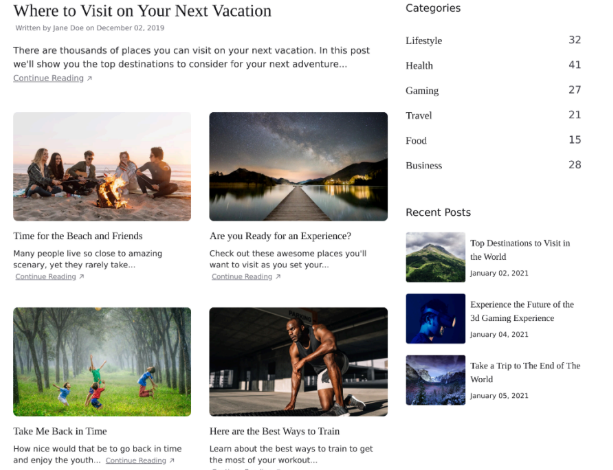

# Tarea1Multimedios
Primera tarea
.
.
.
.
.
.
En esta primera imagen podemos ver la parte superior de la pagina que deseamos clonar
.
.
.

.
.
.
En esta segunda imagen podemos ver la parte superior de la pagina clonada
.
.
.

.
.
.
En esta imagen se ve la parte inferior de la pagina a clonarla
.
.
.

.
.
.
En esta imagen se ve la parte inferior de la pagina clonada
.
.
.

